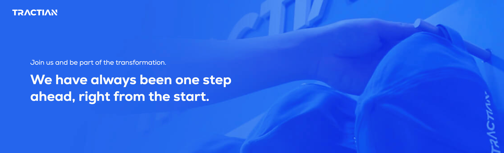

# TRACTIAN Challenges
### [Meet TRACTIAN](https://tractian.com/en/about)

### About this Repository
Every year since its founding, TRACTIAN has doubled in size. Today, we have **more than 350 employees**, and it has been a huge challenge to find people who are culturally aligned and prepared. Additionally, every month we receive **over 5,000 applications from people interested in revolutionizing the industry with us**. We have always been very meticulous in evaluating each application individually. *To find good employees, no precaution is too small.*

This evaluation has become time-consuming, decreasing our ability to quickly assess all candidates. We believe that there isn’t sufficient technology in the market to evaluate candidates the way we do. We have decided to open our challenges to everyone interested in working with us, believing that facing the challenge differentiates you from other candidates and ensures that you are assessed technically beyond your background, LinkedIn, or resume.

> **An interesting fact:** 90% of our top engineers took the challenge in their area to join TRACTIAN.  *It should be clear how important this challenge is.*

> :star: The challenge is an accelerator for the evaluation of your application, those who have completed the challenge will be assessed first.

### Available Challenges
All our challenges are available in this repository, but that does not mean there is an open position for the area/position. We recommend checking if there are available positions for what you want to apply for, [click here to check](https://tractian.com/en/careers).

- [Front-end Software Engineer](./front-end/README.md)
- Mobile Software Engineer (Coming Soon)
- Back-end Software Engineer (Coming Soon)
- Quality Software Analyst (Coming Soon)

### How to submit the challenge?
You must first apply for the position on the career site. At the end of the form, you will find a field to attach the link to the repository. (We only accept links from public GitHub repositories.)

> Thank you for your interest in being part of the startup that is transforming the industry in the world.
> "Not knowing is no reason not to do it, on the contrary. It is the first step to expand your skills"